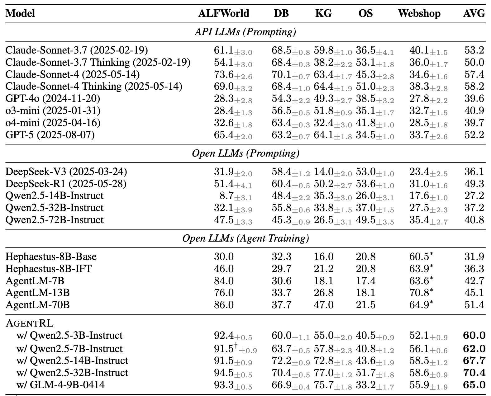

# AgentBench


<p align="center">
   <a href="https://docs.google.com/spreadsheets/d/e/2PACX-1vRR3Wl7wsCgHpwUw1_eUXW_fptAPLL3FkhnW_rua0O1Ji_GIVrpTjY5LaKAhwO-WeARjnY_KNw0SYNJ/pubhtml" target="_blank">🌐 Leaderboard (new)</a> | <a href="https://twitter.com/thukeg" target="_blank">🐦 Twitter</a> | <a href="mailto:agentbench@googlegroups.com">✉️ Google Group</a> | <a href="https://arxiv.org/abs/2308.03688" target="_blank">📃 Paper </a>
</p>

<p align="center">
👋 Join our <a href="https://join.slack.com/t/agentbenchcol-huw1944/shared_invite/zt-20ixabcuv-31cFLBAkqGQxQkJqrWVEVg" target="_blank">Slack</a>  for <i>Q & A</i> or <i><b>collaboration</b> on next version of AgentBench</i>!
</p>

## 🔥[2025.10.10] Introducing **AgentBench FC (Function Calling)** based on [AgentRL](https://github.com/THUDM/AgentRL)

The current repository contains the function-calling version of AgentBench, integrated with [AgentRL](https://github.com/THUDM/AgentRL), an end-to-end multitask and mutliturn LLM Agent RL framework.
If you wish to use the older version, you can revert to [v0.1](https://github.com/THUDM/AgentBench/tree/v0.1) and [v0.2](https://github.com/THUDM/AgentBench/tree/v0.2).

Comparing to the original AgentBench, this version uses a function-calling style prompt,
and adds fully-containerized deployment support for the following tasks:

- `alfworld` (AF)
- `dbbench` (DB)
- `knowledgegraph` (KG)
- `os_interaction` (OS)
- `webshop` (WS)

### Quick Start

We support a quick one-command setup for all the above tasks using Docker Compose.

Before starting, please download or build the following Docker images required by the tasks:

```shell
# dbbench
docker pull mysql:8

# os_interaction
docker build -t local-os/default -f ./data/os_interaction/res/dockerfiles/default data/os_interaction/res/dockerfiles
docker build -t local-os/packages -f ./data/os_interaction/res/dockerfiles/packages data/os_interaction/res/dockerfiles
docker build -t local-os/ubuntu -f ./data/os_interaction/res/dockerfiles/ubuntu data/os_interaction/res/dockerfiles
```

To run the KG freebase server, you will also need a copy of the data found [here](https://github.com/dki-lab/Freebase-Setup).
Download, extract and place the data at `./virtuoso_db/virtuoso.db` (or modify `extra/docker-compose.yml` and set the mount point to your data location).

Then, you can bring up the stack with:

```shell
docker compose -f extra/docker-compose.yml up
```

This command will download or build the necessary Docker images and start the following services in Docker:

- AgentRL Controller
- `alfworld` task worker (x1, increase as needed)
- `dbbench` task worker (x1, increase as needed)
- `knowledgegraph` task worker (x1, increase as needed)
- `os_interaction` task worker (x1, increase as needed)
- `webshop` task worker (x1, increase as needed)
- freebase server (for `knowledgegraph` task)
- Redis server (for container allocation)

If your machine already has Redis (version 7+) running, you can omit the Redis service from the `docker-compose.yml`.

> [!WARNING]  
> Please note that the `webshop` environment requires ~16GB of RAM to start,
> and the current implementation of `alfworld` leaks memory and disk space until the task worker is restarted.
> Make sure your machine has sufficient resources before running.

### Benchmarking Results

We report the results of various models on the test set of AgentBench FC.



Please see our [Leaderboard](https://docs.google.com/spreadsheets/d/e/2PACX-1vRR3Wl7wsCgHpwUw1_eUXW_fptAPLL3FkhnW_rua0O1Ji_GIVrpTjY5LaKAhwO-WeARjnY_KNw0SYNJ/pubhtml) for full results.
Please contact [agentbench_fc&#64;googlegroups.com](mailto:agentbench_fc@googlegroups.com) if you have any questions or would like to contribute your results.

---

## 🔥[2024.08.13] Introducing [VisualAgentBench](https://github.com/THUDM/VisualAgentBench)

VisualAgentBench is designed for evaluating and training visual foundation agents based on large multimodel models (LMMs). We introduce 5 distinct environments spanning 

* Embodied: VAB-OmniGibson, VAB-Minecraft
* GUI: VAB-Mobile, VAB-WebArena-Lite
* Visual Design: VAB-CSS

to systematically benchmark 17 LMMs (proprietary & open LMMs). We also provide the trajectory dataset for behavior cloning training on open LMMs for you to develop your own visual foundation agents!

---

The following is the introduction to the original AgentBench (v0.2).

# AgentBench: Evaluating LLMs as Agents

https://github.com/THUDM/AgentBench/assets/129033897/656eed6e-d9d9-4d07-b568-f43f5a451f04

**AgentBench** is the first benchmark designed to evaluate **LLM-as-Agent** across a diverse spectrum of different
environments. It encompasses 8 distinct environments to provide a more comprehensive evaluation of the LLMs' ability to
operate as autonomous agents in various scenarios. These environments include 5 freshly created domains, namely

-   Operating System (OS)
-   Database (DB)
-   Knowledge Graph (KG)
-   Digital Card Game (DCG)
-   Lateral Thinking Puzzles (LTP)

as well as 3 recompiled from published datasets:

-   House-Holding (HH) ([ALFWorld](https://github.com/alfworld/alfworld))
-   Web Shopping (WS) ([WebShop](https://github.com/princeton-nlp/webshop))
-   Web Browsing (WB) ([Mind2Web](https://github.com/OSU-NLP-Group/Mind2Web))


## Table of Contents

-   [Dataset Summary](#dataset-summary)
-   [Leaderboard](#leaderboard)
-   [Quick Start](#quick-start)
-   [Next Steps](#next-steps)
-   [Citation](#citation)

## Dataset Summary

We offer two splits for each dataset: Dev and Test. The multi-turn interaction requires an LLMs to generate around 4k
and 13k times respectively.


## Leaderboard

Here is the scores on test set (standard) results of AgentBench.


While LLMs begin to manifest their proficiency in LLM-as-Agent, gaps between models and the distance towards practical
usability are significant.


## Quick Start

This section will guide you on how to quickly use gpt-3.5-turbo-0613 as an agent to launch the `dbbench-std` and `os-std` tasks.
For the specific framework structure, please refer to [Framework Introduction](docs/Introduction_en.md).
For more detailed configuration and launch methods, please check [Configuration Guide](docs/Config_en.md)
and [Program Entrance Guide](docs/Entrance_en.md).

### Step 1. Prerequisites

Clone this repo and install the dependencies.

```bash
cd AgentBench
conda create -n agent-bench python=3.9
conda activate agent-bench
pip install -r requirements.txt
```

Ensure that [Docker](https://www.docker.com/) is properly installed.

```bash
docker ps
```

Build required images for `dbbench-std` and `os-std`.

```bash
docker pull mysql
docker pull ubuntu
docker build -f data/os_interaction/res/dockerfiles/default data/os_interaction/res/dockerfiles --tag local-os/default
docker build -f data/os_interaction/res/dockerfiles/packages data/os_interaction/res/dockerfiles --tag local-os/packages
docker build -f data/os_interaction/res/dockerfiles/ubuntu data/os_interaction/res/dockerfiles --tag local-os/ubuntu
```

### Step 2. Configure the Agent

Fill in your OpenAI API Key at the correct location in `configs/agents/openai-chat.yaml`. (e.g. `gpt-3.5-turbo-0613`)

You can try using `python -m src.client.agent_test` to check if your agent is configured correctly.

By default, `gpt-3.5-turbo-0613` will be started. You can replace it with other agents by modifying the parameters:

```bash
python -m src.client.agent_test --config configs/agents/api_agents.yaml --agent gpt-3.5-turbo-0613
```

### Step 3. Start the task server

Starting the task worker involves specific tasks. Manual starting might be cumbersome; hence, we provide an automated
script.

The assumption for this step is that ports from 5000 to 5015 are available. For Mac OS system, you may want to follow [here](https://stackoverflow.com/questions/69955686/why-cant-i-run-the-project-on-port-5000) to free port 5000 to use.

```bash
python -m src.start_task -a
```

This will launch five task_workers each for `dbbench-std` and `os-std` tasks and automatically connect them
to the controller on port 5000. **After executing this command, please allow approximately 1 minute for the task setup to complete.** If the terminal shows ".... 200 OK", you can open another terminal and follow step 4.

### Step 4. Start the assigner

This step is to actually start the tasks.

If everything is correctly configured so far, you can now initiate the task tests.

```bash
python -m src.assigner
```

## Next Steps

If you wish to launch more tasks or use other models, you can refer to the content
in [Configuration Guide](docs/Config_en.md) and [Program Entrance Guide](docs/Entrance_en.md).

For the environment of the remaining five tasks, you will need to download the Docker images we provide.

```
longinyu/agentbench-ltp
longinyu/agentbench-webshop
longinyu/agentbench-mind2web
longinyu/agentbench-card_game
longinyu/agentbench-alfworld
```

The resource consumption of a single task_worker for the eight tasks is roughly as follows; consider this when
launching:

| Task Name | Start-up Speed | Memory Consumption |
| --------- | -------------- | ------------------ |
| webshop   | ~3min          | ~15G               |
| mind2web  | ~5min          | ~1G                |
| db        | ~20s           | < 500M             |
| alfworld  | ~10s           | < 500M             |
| card_game | ~5s            | < 500M             |
| ltp       | ~5s            | < 500M             |
| os        | ~5s            | < 500M             |
| kg        | ~5s            | < 500M             |


### Deploy the KnowledgeGraph service loacally
the KnowledgeGraph task depends on an online service which now is not stable, if you want to deploy the service locally, you can follow steps below:

**step1.** <br />
download the database and setup the service [freebase-setup](https://github.com/dki-lab/Freebase-Setup).


**step2.** <br />
change this line `sparql_url: "http://164.107.116.56:3093/sparql"` to `sparql_url: "<your service api of sparql>"` in `/configs/tasks/kg.yaml`.

**P.S.** you should start your KG service before you start the agent tasks services.

## Extending AgentBench

If you wish to add new tasks to AgentBench, you may refer to [Extension Guide](docs/Extension_en.md).

## References

Avalon task is merged from [AvalonBench](https://github.com/jonathanmli/Avalon-LLM/), which implements a multi-agent framework.

## Citation

```
@article{liu2023agentbench,
  title   = {AgentBench: Evaluating LLMs as Agents},
  author  = {Xiao Liu and Hao Yu and Hanchen Zhang and Yifan Xu and Xuanyu Lei and Hanyu Lai and Yu Gu and Hangliang Ding and Kaiwen Men and Kejuan Yang and Shudan Zhang and Xiang Deng and Aohan Zeng and Zhengxiao Du and Chenhui Zhang and Sheng Shen and Tianjun Zhang and Yu Su and Huan Sun and Minlie Huang and Yuxiao Dong and Jie Tang},
  year    = {2023},
  journal = {arXiv preprint arXiv: 2308.03688}
}
```
