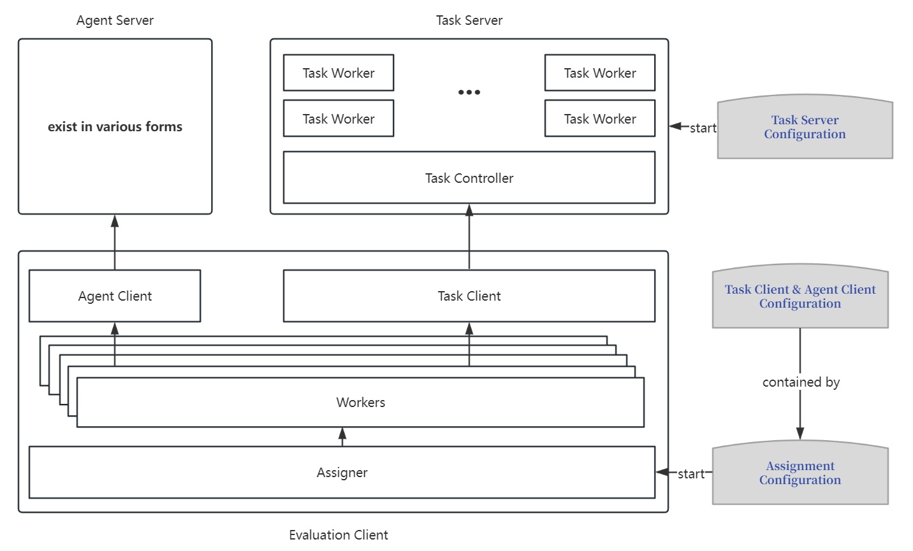

# AgentBench 详解

[🌏English](Introduction_en.md)

## 1. 数据集构成

该 Benchmark 包含了八个任务：

- 操作系统（Operating System）
- 数据库（Database）
- 知识图谱（Knowledge Graph）
- 卡牌对战（Digital Card Game）
- 情景猜谜（Lateral Thinking Puzzle）
- 家居（Householding，ALFWorld）
- 网络购物（Web Shopping，WebShop）
- 网页浏览（Web Browsing，Mind2Web）

### 1.1 操作系统

这个数据集旨在评估语言模型（LLMs）在真实操作系统（OS）的 Bash 环境中执行任务的能力。它包含了问题描述、Docker
环境、初始化脚本、启动脚本、检验脚本和示例脚本等内容。任务分为问题回答和操作，模型需要生成命令来解决问题或执行操作。数据集包含人工和生成的问题，经过单元测试确保质量，总共有144个样本。评估的主要指标是成功率。

### 1.2 数据库

这个数据集旨在评估语言模型（LLMs）在真实数据库上通过 SQL
操作的能力。数据集包含了多样性的指令和数据库，通过整合多个现有数据集并进行数据增强而创建。每个样本包括问题描述、表格信息、表格内容和正确答案。评估过程包括初始化、交互和检查三个步骤。初始化阶段构建了初始
SQL 脚本并初始化了 MySQL 数据库；交互阶段代理需要提供可执行的SQL命令并进行推理，然后执行 SQL
并返回结果；检查阶段根据问题类型比较代理的答案与标准答案或表格哈希值来判断答案的正确性。评估的主要指标是成功率。

### 1.3 知识图谱

这数据集旨在评估语言模型（LLMs）在复杂知识图谱（KG）中的决策能力。数据集包含来自 Freebase
的知识库问题回答（KBQA）数据，每个数据项包括输入问题、已知实体列表、行动序列和标准答案。任务要求 LLMs
通过多次工具调用进行长期规划以回答问题。评估中，LLMs 与知识库交互并生成行动序列，然后预测答案。评估基于F1分数、精确匹配度和可执行性进行。

### 1.4 卡牌对战

该数据集旨在评估语言模型（LLMs）在数字卡牌游戏（DCG）中的表现。DCG是一种回合制策略游戏，要求LLMs理解游戏规则、制定战略和做出决策。数据集使用修改后的
DCG 系统 Aquawar 进行评估，包括规则、配置和评估设置。评估指标包括完成率、非法操作次数、击败敌方卡牌数量、总伤害和游戏胜率。

### 1.5 情景猜谜

该数据集旨在评估大型语言模型（LLMs）在侧重横向思维的情景谜题（LTP）中的表现。LTP
是一种群体游戏，通常由一位主持人提出谜题，其他参与者通过提问与谜题相关的问题来猜测答案。主持人只能回答“是”、“否”或“无关”。游戏的目标是在揭示谜题的关键情节之前猜出答案。每条样本包含故事、答案、解密进程要点。LLMs被要求充当解谜者的角色，提出问题并综合主持人的回答来猜测答案。游戏有最大回合限制，解谜者需要在每轮提出问题，主持人回答问题。

评估LLMs的任务包括初始化游戏环境、模拟LLMs与主持人的互动以及检查LLMs的回答。评估使用的指标包括单局游戏准确率（SGA）、回合效率（RE）、查询相关性（QR）和游戏进展（GP）等。

### 1.6 家居

ALFWorld 数据集旨在评估语言模型在模拟家庭环境中完成任务的能力。模型需要根据环境描述和目标指令，通过文本界面进行决策和动作执行，动态调整计划以完成任务。评估指标是成功率。

### 1.7 网络购物

该数据集旨在评估大型语言模型（LLMs）在模拟的在线购物环境中的表现，该环境模拟了真实的电子商务网站。数据集包括约一百万个产品，来自
Amazon.com，每个产品都带有属性标签。此外，数据集还包括 12,087 个人类指令，每个指令都与特定目标和期望的属性相关联。评估的目标是要求
LLMs 根据指令在虚拟购物环境中进行购物，并选择符合期望属性的产品。

评估过程分为指导、互动和计算奖励三个步骤。LLMs 接收指导，然后在虚拟购物环境中与网站互动，浏览和选择产品。最后，根据选定产品的属性与期望属性的相似度，计算奖励分数。

评估的主要指标是匹配奖励，根据所选产品与期望属性的匹配程度来评估LLMs的性能。该评估充分考虑了多个适合查询的产品的情况，以更准确地反映LLMs的性能。

### 1.8 网页浏览

Mind2Web
是一个通用的网络代理评估基准，旨在评估语言模型（LLMs）在不同领域的网站上执行复杂任务的能力。该数据集包含来自旅游、信息、服务、购物和娱乐领域的任务，涵盖了跨多个网站的跨领域测试集。每个任务包括任务描述、参考动作序列和网页信息，旨在测试
LLMs 在网页浏览和交互环境中的性能。

评估过程包括两个步骤，首先使用一个小型语言模型对 HTML 元素进行排名和筛选，以提高推理效率，然后将元素选择构建为多选问题，提供五个候选项供模型选择。评估指标包括元素准确性、动作
F1 得分和成功率，其中主要指标是步骤成功率，用于显示每个操作步骤的独立准确性。

该评估基准的目标是测试LLMs在通用网络环境中的能力，特别是在处理真实网页的原始HTML代码时所面临的挑战。

## 2. 框架介绍

框架的设计思路和理念是尽量地将各个部分解耦，使得各个部分可以独立地进行开发、测试和部署。
这样做的目的主要是因为不同的任务对于系统资源和环境的要求各不相同，很难统一地进行设计。
这样做的好处还包括便于后续扩展和维护。
同时，为了方便使用，框架的各个部分都提供了相应的配置文件，可以根据需要进行修改。
各部分可以分别部署在不同的机器上，也可以部署在同一台机器上，部分之间通过HTTP协议通信。

如图所示，整体框架有三部分组成。第一部分是 Task Server，
这一部分的主要用途顾名思义是用来主持一个任务环境，
提供任务描述并根据 Agent 的响应来做出相应的环境反馈。
第二部分是 Agent Server，这部分的作用就是提供一个可以根据历史记录信息做推理 Agent 的接口。
第三部分是 Client，Client 根据配置文件的要求统筹和调配任务，将 Agent 和 Task 的输出相互转发。
每一个部分内部的结构在后面进行介绍。

例如，如果想测试 ChatGLM2-6B 在 WebShop 和 DBBench 任务上的表现，那么需要做的就是：

1. 将 ChatGLM2-6B 的模型用 FastChat 部署，得到一个 Agent Server。
2. 修改 Task Server 配置文件，将 WebShop 和 DBBench 的任务环境分别部署。
3. 修改 Client 配置文件，指定使用 FastchatClient 并指定测试 WebShop 和 DBBench，启动。

### 2.1 Agent Server

Agent Server 在设计上允许任何形式的服务器。
目前实际上采用 Fastchat 作为本地模型的 Server。
对于仅提供API的模型，可直接在 Agent Client 中实现对应接口。

### 2.2 Task Server 介绍

Task Server 主要包括两部分：Task Worker 和 Task Controller。

Task Controller 负责统筹所有的 Task Worker，并将统一的接口暴露给 Client。
全局应当只有一个 Task Controller。
Task Controller 主要负责一下几件事情：

- 等待 Task Worker 连接，接收 Task Worker 的注册信息。
- 收到 Client 请求后将任务分配给空闲的 Task Worker。
- 响应 Client 后续的请求，将请求转发给相应的 Task Worker。

需要关注的主要是以下两个接口：

- `POST /api/start_sample` 此接口用于开始一个新的测试样例，并返回一个 `session_id` 用于识别，分配任务到 Task
  Worker 在此时发生，返回的内容还包括任务描述，即初始 Prompt。
- `POST /api/interact` 此接口用于 Agent 和 Task 的交互，接收 Agent 的输出并将输出转发给相应的 Task Worker，返回 Task
  Worker（即任务环境）的输出。

每一个 Task Worker 负责一个具体的任务环境，Task Worker 可以根据配置文件要求自行启动和加载环境。
如果想要自己实现一个新的任务环境，只需要继承 Task 类实现，然后在配置文件中指定即可。
如果同一个任务想要开多个并发，推荐的做法是开启多个 Task Worker，这样做的好处是可以保证环境互不干扰，且可绕开 `GIL`。
如果此任务不是 CPU 密集型或者多个并发之间有大量可共用的资源，框架也允许 Task 标明单个 Worker 最大可接受的并发数。

### 2.3 Client

Client主要包含三部分：

- Assigner 负责根据目前各个任务以及模型的并发数，统筹、规划和分配样例的测试，并生成对应数量的Worker及其Agent Client和Task
  Client。
- Agent Client 负责实现 Agent Server 要求的对应的接口，暴露统一的 `AgentClient.inference(self, history)`。
- Task Client 面对唯一的 Task Controller，因此实现是唯一的。其核心方法是 `TaskClient.run_sample(self, index, agent)`
  ，需要负责将传入的 `Agent` 和 `Task` 的输出相互转发。

Assigner 读取对应的配置文件，得到一个从 Agent 到 Task 的二分图。
在此二分图的基础上，我们构造一个 s 点和 t 点，
从 s 到 Agent 的边的容量为 Agent 的并发数，
从 Task 到 t 的边的容量为 Task 的并发数，
Agent 和 Task 之间的边的容量为待评测样例数。
Assigner 的核心分配逻辑就是在以上图中进行的一个实时最大网络流算法。
每当有空余的 Agent 或者 Task 时，就运行算法得到一个流图，
并根据从 Agent 到 Task 上的边的流量启动对应数量的 worker 并分配到相应的样例上。
每个 worker 只负责一个样例，拥有一个 Agent Client 对象和一个 Task Client 对象。
